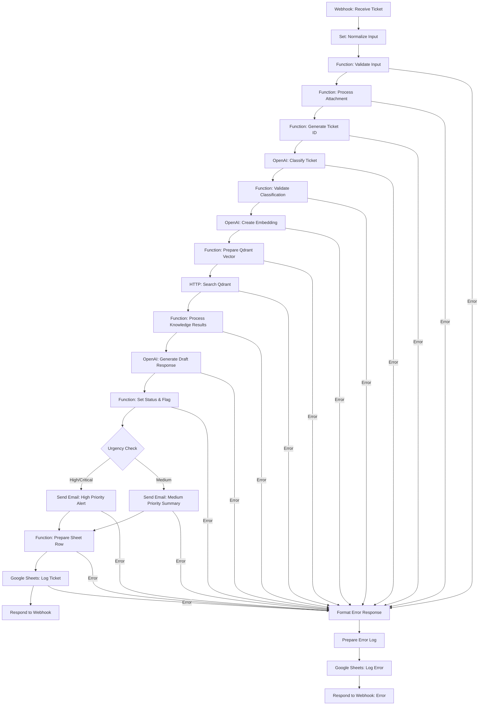
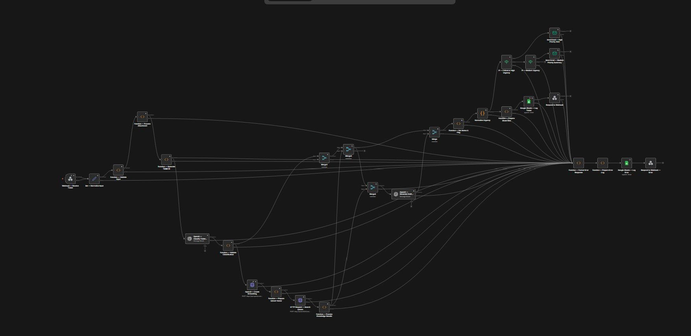

# AI Support Ticket Processing - Part 1 (Enhanced)

## Architecture & Implementation Notes

### Key Architecture Decisions
- **Containerized Orchestration:** All services (n8n, Qdrant, payload inserter) run in Docker Compose for reproducibility and easy local/production deployment.
- **Service Networking:** Internal service names (e.g., `n8n`, `qdrant`) are used for inter-container communication, ensuring reliable connectivity.
- **Separation of Concerns:** Each step (intake, validation, AI, RAG, routing, logging) is a distinct node or service, making the workflow auditable and maintainable.
- **Error Handling:** Every major step has error paths that log to Google Sheets and allow the workflow to continue or fail gracefully.
- **Auditability:** All processing steps and decisions are logged in a processing log column in Google Sheets for traceability.

### AI Output Validation: Approach & Rationale
- **Strict JSON Schema:** The OpenAI classification prompt demands a specific JSON schema (category, urgency, sentiment, confidence, summary).
- **Regex & Fallback Parsing:** If the AI output is not valid JSON, the workflow attempts to extract JSON via regex. If that fails, a rule-based fallback classification is used with low confidence.
- **Field & Value Checks:** All required fields are checked for presence and validity (e.g., urgency must be one of four values, confidence must be 0-1).
- **Manual Review Flag:** If confidence < 0.6 or validation fails, the ticket is flagged for manual review, ensuring no bad AI output is auto-routed.
- **Why:** This layered approach ensures robustness against LLM hallucinations, formatting errors, and API changes, while never dropping a ticket.

### RAG Implementation
- **Chunking Strategy:** Fixed-size chunking of 300 characters with 50-character overlap for all knowledge base markdown files. This balances context retention and embedding efficiency.
- **Embedding Model:** OpenAI `text-embedding-3-small` (1536 dimensions) is used for semantic search, chosen for its quality and compatibility with OpenAI's API.
- **Retrieval Approach:**
  - Embedding is created for the combined subject, message, and attachment text.
  - Qdrant is queried for the top-3 most similar chunks using cosine similarity.
  - Retrieved chunks are included in the AI prompt for draft response generation, with source and relevance score logged.
  - If no relevant chunk is found (low retrieval score), the draft response includes a fallback message.

### What Would Improve With More Time
- **Semantic Chunking:** Use sentence/paragraph boundaries or a text splitter library for smarter chunking, improving retrieval quality for long or complex docs.
- **Reranking:** Add a cross-encoder or reranker model to improve the relevance of the top-3 results from Qdrant.
- **Feedback Loop:** Track which KB chunks are actually used in final responses and retrain or re-chunk the KB based on support team feedback.
- **Async/Retry Logic:** Add retry/backoff for webhook and embedding calls to handle transient errors and rate limits more gracefully.
- **UI Dashboard:** Build a dashboard for real-time monitoring of ticket flow, AI confidence, and manual review rates.
- **On-Prem Embeddings:** For strict privacy, switch to open-source embedding models (e.g., sentence-transformers) and run all inference locally.
- **Advanced PDF Handling:** Integrate OCR and robust PDF parsing for scanned or image-based attachments.

## Overview

This system automates support ticket intake, classification, knowledge retrieval, draft response generation, and routing using n8n, OpenAI, Qdrant, and Google Sheets. The workflow is designed for robust error handling, PDF attachment support, and clear audit trails.

## Workflow Diagram

   

---

## Workflow Steps (as implemented)

1. **Webhook Intake**
   - Receives POST requests at `/support-ticket` with fields: `name`, `email`, `subject`, `message`, and optional `attachment` (filename/content).

2. **Input Normalization**
   - Extracts and normalizes all fields, including optional attachment data.

3. **Input Validation**
   - Checks for required fields and validates email format (regex).
   - On validation error, logs to Google Sheets error log and returns error response.

4. **Attachment Processing**
   - If an attachment is present and text is provided, appends it to the message for downstream AI and RAG steps.
   - If attachment is present but no text, logs this in the processing log.

5. **Ticket ID Generation**
   - Assigns a unique ticket ID and timestamp.

6. **AI Classification (OpenAI)**
   - Prompts OpenAI (gpt-4o-mini) to classify the ticket into category, urgency, sentiment, confidence, and summary.
   - If AI output is not valid JSON or missing fields, falls back to regex-based extraction and rule-based classification with low confidence.

7. **Classification Validation**
   - Ensures all required fields are present and valid. If not, falls back to rule-based classification and logs a warning.

8. **Embedding Creation**
   - Calls OpenAI Embeddings API (text-embedding-3-small) on the combined subject/message/attachment text.
   - Handles various possible response formats for robustness.

9. **Qdrant Knowledge Search**
   - Searches Qdrant for top-3 most relevant knowledge base chunks using the embedding vector.
   - Includes payload and relevance scores in the result.

10. **Knowledge Result Processing**
    - Formats retrieved knowledge for prompt inclusion and logs retrieval confidence.
    - If no relevant knowledge is found, notes this for the draft response.

11. **Draft Response Generation (OpenAI)**
    - Prompts OpenAI to generate a draft support response, referencing knowledge sources if available.
    - If retrieval confidence is low, includes a fallback message.

12. **Status & Manual Review Flag**
    - If AI confidence < 0.6, flags ticket as `needs-manual-review`.
    - Logs all processing steps for audit.

13. **Urgency Routing**
    - If urgency is `critical` or `high`, sends a detailed alert email.
    - If urgency is `medium`, sends a summary email.
    - All tickets are logged to Google Sheets.

14. **Google Sheets Logging**
    - Logs all ticket data, including processing log, to a main sheet.
    - Errors are logged to a separate error sheet.

15. **Webhook Response**
    - Returns a JSON response with ticket ID and status.

---

## Error Handling
- Every major step has error paths that log to Google Sheets and return a structured error response.
- Fallback logic ensures that even if AI or embedding steps fail, the ticket is still processed and flagged for review.

---

## Environment & Deployment
- **Docker Compose** runs n8n, Qdrant, and now also a one-shot service to run `insert_payloads.py` after both are up.
- All credentials (OpenAI, Google Sheets, SMTP) are set via environment variables in `.env`.
- Knowledge base markdown files are ingested using `ingest_kb.py`.
- Workflow is imported and activated via the n8n UI at http://localhost:5678.

### Startup Sequence
1. Copy `.env.example` to `.env` and fill in all required variables.
2. Run `docker compose up -d` (this will start n8n, Qdrant, and automatically run `insert_payloads.py` in a one-shot Python container).
3. (Optional) Manually run `python ingest_kb.py` if you update the knowledge base.
4. Import the workflow in the n8n UI and configure credentials.

---

## Google Sheets Schema
| Column            | Purpose                                 |
|-------------------|-----------------------------------------|
| ticket_id         | Unique ticket identifier                |
| timestamp         | ISO timestamp of ticket creation        |
| name              | Customer name                           |
| email             | Customer email                          |
| subject           | Ticket subject                          |
| category          | AI-classified category                  |
| urgency           | AI-classified urgency                   |
| sentiment         | AI-classified sentiment                 |
| confidence        | AI confidence score (0-1)               |
| ai_summary        | AI-generated summary                    |
| draft_response    | AI-generated draft response             |
| knowledge_sources | JSON array of cited KB sources          |
| status            | normal / needs-manual-review            |
| processing_log    | Step-by-step log for audit              |

---

## Testing
- Use `curl` or Postman to POST to `/support-ticket` with required fields.
- Attachments should be base64-encoded text if sent via JSON.
- Check Google Sheets for ticket and error logs.
- Check email inbox for alert/summary emails (SMTP must be configured).

---

## Notes
- All logic, error handling, and routing strictly follow the provided n8n workflow JSON.
- For further details, see the workflow file: `AI Support Ticket Processing - Part 1.json`.
